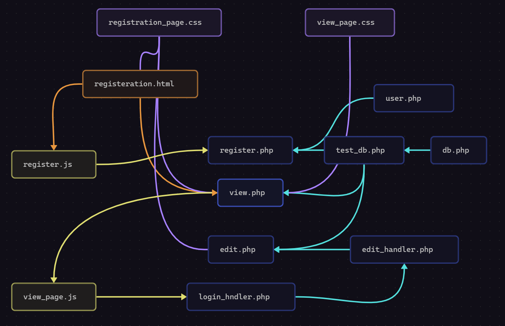

  

---

  

###  File Structure Breakdown

```markdown
project-root/
├── public/                  # Web server root (publicly accessible)
│   ├── assets/
│   │   ├── js/              # Client-side JavaScript
│   │   │   ├── register.js
│   │   │   └── view_page.js
│   │   └── css/             # Stylesheets
│   │       ├── registration_page.css
│   │       └── view_page.css
│   └── registration.html    # Static HTML pages
│   
│
├── src/                     # Backend application code (NOT publicly accessible)
│   ├── controllers/         # Request handlers
│   │   ├── edit_handler.php
│   │   └── login_handler.php
│   ├── models/              # User class
│   │   └── User.php
│   ├── utils/               # Utilities/helpers
│   │   ├── db.php           # Class to handle Database connection
│   │   └── test_db.php       # Test DB connection and return it  
│   └── views/               # PHP view templates
│       ├── edit.php
│       ├── register.php
│       └── view.php
│
│
└── README.md                # Documentation
```

#### **Registration Module**

- `registeration.html`  

  *Client-side registration form* (HTML markup)

- `registration_page.css`  

  *Styles for registration page* (visual presentation)

- `register.js`  

  *Client-side validation/behavior* (passes data to php file)

- `register.php`  

  *Server-side registration handler* (processes form submission, saves to DB)

####  **Profile Management**

- `view.php`  

  *Profile display page* (reads user data from DB)

- `view_page.css`  

  *Profile view styling*

- `view_page.js`  

  *Profile page interactivity* (opens login menu when edit/delete are selected)

- `edit.php`  

  *Profile editor UI* (form for modifying user data)

- `edit_handler.php`  

  *Update processor* (handles profile edit submissions)

####  **Authentication Module**

- `login_handler.php`  

  *Login processor* (verifies credentials, starts sessions)

  

---

  

###  Key Architecture Principles

1. **Separation of Concerns**:

   - Presentation (HTML/CSS) separated from logic (PHP/JS)

   - Dedicated handlers for database operations

2. **Client-Server Model**:

   - Frontend: HTML/CSS/JS for UI/UX

   - Backend: PHP for business logic and data persistence

3. **Stateless HTTP**:

   - Sessions managed via PHP session cookies

4. **Modular Design**:

   - Independent components for registration/auth/profile management

  

---