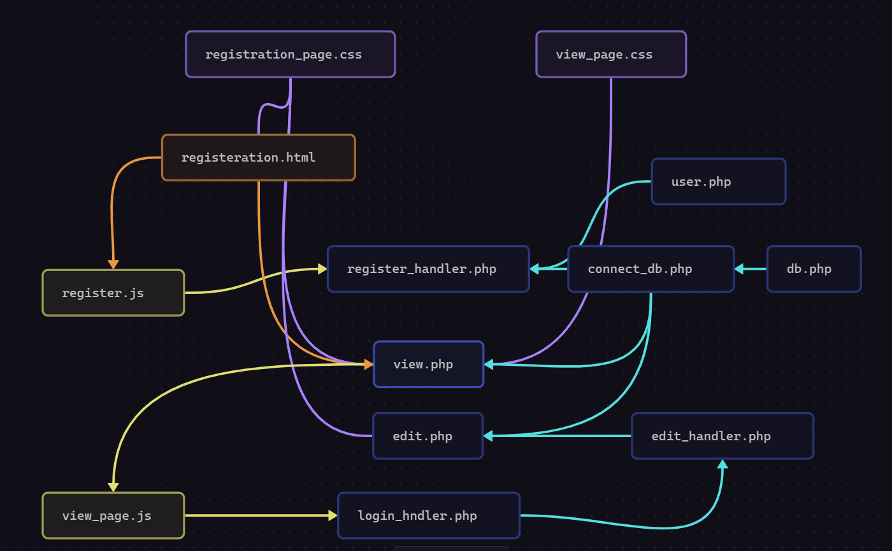

  

---

###  **File Structure Breakdown**

```markdown
project-root/
├── public/                  # Web server root (publicly accessible)
│   ├── assets/
│   │   ├── js/              # Client-side JavaScript
│   │   │   ├── register.js
│   │   │   └── view_page.js
│   │   └── css/             # Stylesheets
│   │       ├── registration_page.css
│   │       └── view_page.css
│   └── registration.html    # Static HTML pages
│   
│
├── src/                     # Backend application code (NOT publicly accessible)
│   ├── controllers/         # Request handlers
│   │   ├── edit_handler.php
│   │   ├── login_handler.php
│   │   └─  register_handler.php
│   ├── models/              # User class
│   │   └── User.php
│   ├── utils/               # Utilities/helpers
│   │   ├── db.php           # Class to handle Database connection
│   │   └── connect_db.php   # Test DB connection and return it  
│   └── views/               # PHP view templates
│       ├── edit.php
│       └── view.php
│
│
└── README.md                # Documentation
```

---

### **Project Workflow Overview**

1. **Main Page : `registration.html`**  
    This page presents the user with two primary actions:
    - **Submit**:  
        Triggers the `register.js` script, which sends the form data to `register_handler.php` via AJAX (JavaScript), allowing the data to be saved to the database without reloading or redirecting the page. This ensures a smoother user experience by keeping the user on the same page.
    - **View**:  
        Redirects the user to the `view.php` page, where all registered data entries from the database are displayed.
        
2. **View Page : `view.php`**  
    Each entry in the data table includes two action buttons:
    - **Edit**:  
        Redirects the user to the `edit.php` page to update the selected entry.
    - **Delete**:  
        Deletes the selected entry from the database.
    > Both actions are gated behind an authentication step. When either button is clicked, a login modal appears, prompting the user to enter the email and password associated with the selected entry.
    
    - The login form includes hidden fields for the **user ID** and **action type** (edit/delete), which are populated using `view_page.js`.
    - Authentication is handled by the `login_handler.php` script.
        
3. **Edit Page : `edit.php`**  
    The edit form is similar in layout to the registration form. When accessed, it pre-fills all user data (except the password) into the input fields, allowing the user to modify any information as needed.  
    Data submission is handled by `edit_handler.php`.
    
4. **Database Integration**
    - **Connection Management**: Handled by `connect_db.php`, which establishes a connection to the MySQL database.
    - **Database Initialization**: Managed by `db.php`, which handles the creation of the database and necessary tables.
        
5. **User Class – `user.php`**  
    Defines the `User` class, encapsulating all user data and handling password hashing for security.
    

---
### **MVC Structure Breakdown**

#### **1. Registration Module**
- **View**
    - `public/registration.html`  
        _Provides the registration form UI (HTML markup). 
    - `public/assets/css/registration_page.css`  
        _Applies styling to the registration form._
        
- **Controller**
    - `src/controllers/register_handler.php`  
        _Handles form submission, validates input, and coordinates saving the data via the model._
        
- **Client-Side (Optional MVC extension)**
    - `public/assets/js/register.js`  
        _Handles client-side validation and submits form data via AJAX without a full page reload._
        
#### **2. Profile Management Module**
- **View**
    - `src/views/view.php`  
        _Displays all user profiles from the database._
    - `src/views/edit.php`  
        _Displays a form for editing an existing user profile._
    - `public/assets/css/view_page.css`  
        _Applies layout and styling to the profile view/edit pages._
        
- **Controller**
    - `src/controllers/edit_handler.php`  
        _Processes updates submitted via the edit form._
        
- **Client-Side (View Helpers)**
    - `public/assets/js/view_page.js`  
        _Adds interactivity to the view page: shows login popup, sets hidden inputs for user actions._
        
#### **3. Authentication Module**
- **Controller**
    - `src/controllers/login_handler.php`  
        _Processes login requests, validates credentials, and manages authentication logic._
        
#### **4. Model Layer**
- **Model**
    - `src/models/User.php`  
        _Represents the User entity. Includes user-related logic such as password hashing and data encapsulation._
        
#### **5. Utility Layer**
- **Database and Helpers**
    - `src/utils/db.php`  
        _Handles database creation and schema setup._
    - `src/utils/connect_db.php`  
        _Initializes and returns an active database connection._
        

---
### **Key Architectural Principles**

1. **Separation of Concerns**
    - Clear distinction between presentation and logic layers:
        - _HTML/CSS_ handle the UI layout and styling
        - _JavaScript_ manages client-side interactivity
        - _PHP_ handles server-side processing
            
    - Database operations are encapsulated within dedicated controller and utility modules.
        
2. **Client–Server Architecture**
    - **Frontend**: Built using HTML, CSS, and JavaScript to deliver a responsive and interactive user experience.
    - **Backend**: Powered by PHP to handle application logic, data validation, authentication, and communication with the database.
        
3. **Session Management over Stateless Protocol**
    - While HTTP is inherently stateless, user sessions are maintained securely through PHP session cookies to manage authentication and user-specific interactions.
        
4. **Modular and Scalable Design**
    - Application functionality is divided into self-contained modules for:
        - Registration
        - Authentication
        - Profile viewing and editing
            
    - This modular approach promotes maintainability, reusability, and scalability.
        

---